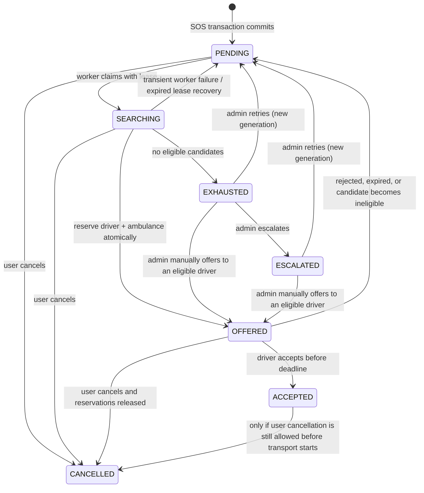

# ResQ ambulance dispatch engine

## State machine

A single `DispatchJob` is created in the same MongoDB transaction as a valid SOS request. The hospital remains the destination throughout dispatch; choosing a hospital does not assign an ambulance.



`DispatchJob.status` is the authoritative dispatch state. Each attempt has its own UUID, generation, candidate IDs, route source, server deadline, outcome, response time and reason. Each job event records the actor, timestamp, and reason. Trip status is separately governed by the existing `TRIP_STATUSES`.

## Eligibility and ranking

A candidate is eligible only when all of these checks pass at search time and again inside the reservation/acceptance transaction:

- Provider is `ACTIVE` and `VERIFIED`.
- Ambulance is `ACTIVE`, `VERIFIED`, and `AVAILABLE`.
- Driver is `ACTIVE`, license `VERIFIED`, `ONLINE`, assigned to that ambulance, and belongs to the same provider.
- Ambulance location has valid coordinates and was updated within 90 seconds (future timestamps beyond a 5-second clock-skew allowance are rejected).
- Neither driver nor ambulance has an active trip.
- Neither resource has another unexpired dispatch reservation.
- Candidate is within the 100 km dispatch search radius.

The worker prefilters geographically, asks Google Routes for driving distance/ETA for up to 30 nearest eligible candidates, and ranks successful driving routes by ETA. Candidates whose route lookup fails are explicitly marked `STRAIGHT_LINE_FALLBACK` and rank after candidates with driving ETAs. A fallback never pretends to be a driving ETA.

## Reservation, offer and acceptance

1. Worker atomically claims a job using a persisted 30-second lease. An expired `SEARCHING` lease can be recovered after restart.
2. A MongoDB transaction rechecks the emergency request, provider, driver, ambulance, location freshness and active trips.
3. Conditional updates reserve both ambulance and driver with the dispatch job ID and the same expiration timestamp. The job is changed to `OFFERED` in that transaction. Any failed conditional update aborts all reservation writes.
4. The authenticated driver can poll `GET /api/v1/ambulance-driver/dispatch-offers`; an SSE event is a notification only, never authority.
5. The acceptance deadline is stored in MongoDB (25 seconds). The frontend countdown is display-only. The worker expires offers and releases only reservations whose `dispatchReservationId` matches that job.
6. Acceptance checks the current offer UUID, assigned driver, server deadline, fresh location, provider, ambulance, hospital and emergency state again. It then creates the existing `Trip`, marks driver and ambulance busy, updates the emergency assignment, and marks the dispatch attempt accepted in one transaction. The existing unique `Trip.emergencyRequestId` constraint prevents a second trip for the same emergency.
7. Late acceptances and offers superseded by rejection, timeout, cancellation or reassignment fail with a conflict.

## Retry and recovery policy

- Offer deadline: 25 seconds, enforced on the server.
- Candidate unavailable / rejected / expired: release owned reservations, record the reason, and return the job to `PENDING`. Candidates are not repeated within the same generation.
- Search infrastructure error: return the job to `PENDING` with a 5-second retry delay and an audit event.
- No remaining eligible candidates: persist `EXHAUSTED`, timestamp it, and notify the emergency/operations channels. No automatic endless retry loop.
- Admin retry: allowed from `EXHAUSTED` or `ESCALATED`, increments the generation, and retains previous attempt history.
- Manual assignment: admin specifies a driver ID; the same operational eligibility, location, route, reservation and server deadline checks still apply. Manual selection does not bypass acceptance.
- Escalation: admin can persist `ESCALATED` with a reason. The UI retains a direct 112 action.
- Startup recovery: worker scans for orphaned legacy coordination requests, recovers expired search leases, and checks expired or now-ineligible offers. Dispatch jobs and deadlines live in MongoDB, not browser timers.
- Cancellation: the user's existing authorization and state-transition checks still apply. Pending offers are cancelled and only resources reserved by that job are released. Cancellation after material patient transport has started remains prohibited.

## API

### Driver (authenticated `AMBULANCE_DRIVER`)

- `GET /api/v1/ambulance-driver/dispatch-offers`
- `POST /api/v1/ambulance-driver/dispatch-offers/:id/accept`
- `POST /api/v1/ambulance-driver/dispatch-offers/:id/reject`

Legacy direct assignment/acceptance endpoints reject SOS requests managed by a dispatch job.

### Admin (authenticated `ADMIN`)

- `GET /api/v1/admin/dispatch-jobs?status=EXHAUSTED&limit=50`
- `POST /api/v1/admin/dispatch-jobs/:id/retry`
- `POST /api/v1/admin/dispatch-jobs/:id/manual-assign` with `{ "driverId": "<ObjectId>" }`
- `POST /api/v1/admin/dispatch-jobs/:id/escalate` with `{ "reason": "..." }`

### User

Existing emergency GET/list responses include a dispatch summary: status, attempt count, deadline/exhaustion/escalation metadata, and a call-112 hint for exhausted/escalated dispatch.

## Database changes and safe rollout

- New collection/model: `DispatchJob`. One job per emergency request; attempt and event history is embedded in that job.
- Additive optional fields on existing `Ambulance` and `AmbulanceDriver` documents: `dispatchReservationId` and `dispatchReservationExpiresAt`. Existing records remain readable.
- Existing `EmergencyRequest`, `Trip`, `Ambulance`, `AmbulanceDriver`, `AmbulanceProvider`, and hospital collections are reused. No reset, destructive migration, seed, or production data rewrite.
- Production has Mongoose auto-index creation disabled. Run the dispatch index dry run and review it before applying. The script checks for duplicate jobs per emergency and never drops/replaces an index.

```bash
cd server
npm run ensure:dispatch-indexes
npm run ensure:dispatch-indexes -- --apply
```

Run only in an authorized deployment environment after confirming the database target and backup/rollback procedure. The apply step creates missing indexes only.

## Tests

Unit tests cover state transitions, driving-route ranking, freshness limits and server-deadline acceptance. A gated concurrency integration test uses only `DISPATCH_TEST_MONGODB_URI`; it requires a dedicated replica-set test database whose name contains `test` or `dispatch`. It creates and deletes only uniquely identified fixtures, races two jobs for the same ambulance/driver, races duplicate acceptances, and verifies one persisted trip.

```bash
cd server
npm run typecheck
npm run lint
npm test
npm run build
```

For the concurrency test, configure `DISPATCH_TEST_MONGODB_URI` to the isolated test database and rerun `npm test`. The integration test is skipped when that variable is absent; unit tests still run.

## Staging acceptance checklist

- [ ] Nearest eligible candidate by driving ETA receives the first offer.
- [ ] Busy, offline, unverified, unassigned, stale-location, wrong-provider, and active-trip candidates are excluded.
- [ ] Routing outage uses an explicit straight-line fallback and never fabricates ETA.
- [ ] Acceptance creates exactly one active trip and sets driver/ambulance BUSY.
- [ ] Rejection, timeout and mid-offer ineligibility release only this job's reservation and advance to the next candidate.
- [ ] Concurrent jobs cannot reserve the same ambulance or driver.
- [ ] Duplicate acceptance returns the existing result safely or a conflict; trip count remains one.
- [ ] Expired/superseded offers cannot be accepted later.
- [ ] Exhaustion is visible to user and admin; retry, manual offer and escalation work.
- [ ] Restart while SEARCHING or OFFERED preserves the persisted lease/deadline and recovers work.
- [ ] Cancellation ends offers and releases only matching reservations; cancellation after transport starts is rejected.
- [ ] Unauthorized driver/provider/admin actions are rejected by role and ownership checks.
